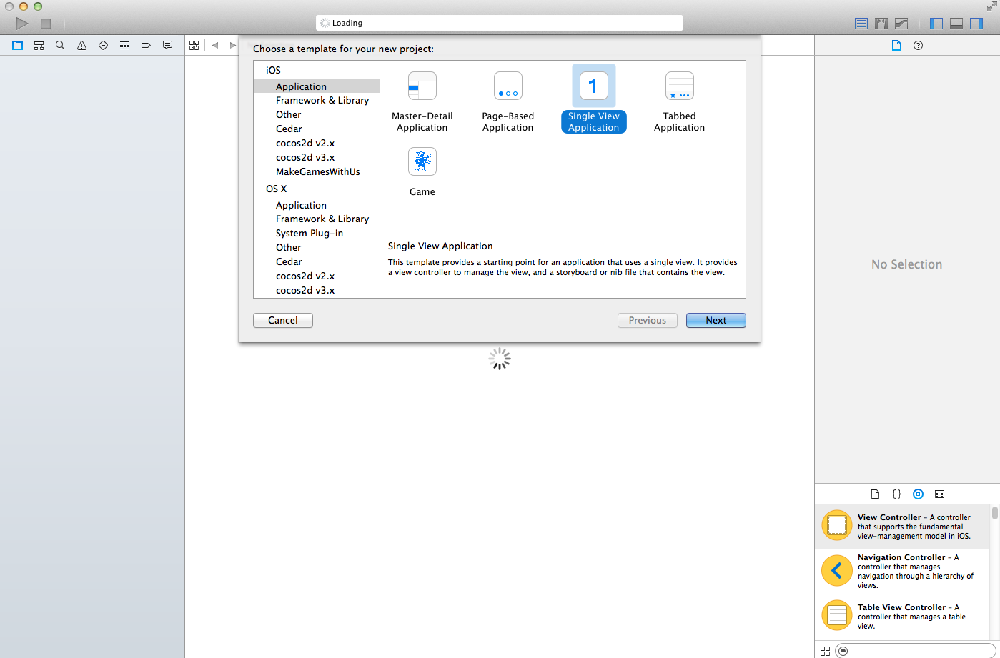
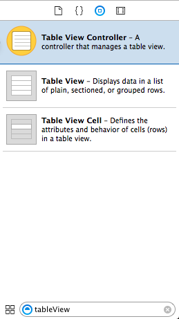

#Setting up a new project

Open Xcode 6 and select *File -> New Project*. Then choose create a *Single View Application*:

Choose the name for your application and select *Objective-C* as language:

After hitting *next* and choosing a project location Xcode will create the new project, based on a project template. You will see that the template contains, among additoinal files, an `AppDelegate` class, a `ViewController` class and a `Main.storyboard` file:

#Configuring the Storyboard

We want to create an App that can display notes. The app will consist of two different View Controllers, the first one will display a list of notes, the second one will display the details of a note when it is selected from the list. We will design the entire layout of this app in Storyboard. Open the `Main.storyboard` file to get started.

##Setting up the Notes List View Controller

Let's start by creating the first View Controller that displays a list of notes. Whenever we want to display items in a list on iOS we use a component called `UITableView`. Since that component is used very often Interface Builder provides a template View Controller called *Table View Contoller* that provides a basic table view and a ViewController that is associated with it. Before we create it let's remove the default View Controller that has been created as part of the template:

- Select the View Controller in the Storyboard by clicking into it and hit the delete key
- Remove the `ViewController` class from Xcode (Selectn "Move to Trash" when prompt appears)

Now your Xcode project should look like this:

Now select the *Table View Controller* from the Object Library on the bottom right of the Interface Builder UI. You can use the search bar at the bottom to filter the list:

Drag the selected Controller to the Storyboard stage. Now you have added the first View Controller to your app.

iOS needs to know which View Controller in our app shall be displayed first (that is called the Root View Controller). In Storyboard we can configure this setting by selecting the Table View Controller and opening the Attributes Inspector in the right panel. Here we can select the setting *is initial View Controller*:

Make sure you have selected the Table View Controller and not the Table View, otherwise you won't be able to find the setting in the inspector. The easiest way to ensure that the Controller is selected is using the Scene Overview in the left panel. In Storyboard based applications the *Info.plist* file has an entry *Main storyboard file base name* that indicates the main storyboard file. The *initial* View Controller within the *main* Storyboard file is the one that will be displayed as Root View Controller.

Now that we have configured a Root View Controller we can run the App for the first time and we should be able to see an empty list:

You will realize that the iPhone 6 and the iPhone 6 Plus Simulators have large screen sizes. If you are working on a Mac with a small screen you might want to downscale the iOS Simulator:

##Adding a Detail View Controller

Now we'll add the View Controller that will display the details of a selected Note. For this second View Controller we will not use a template but instead start with a blank View Controller. Select a *View Controller* from the Object Library in the bottom right and drag it to the Storyboard. For now we will just configure the high level navigation in our App, that means we won't fill the Detail View Controller with Views just now. 

To complete the basic layout of our App we need to add a way to switch between the list and the detail view. Whenever an App has more than one View Controller that we want to display, we need to use Container View Controllers that can handle multiple Child View Controllers and provide easy mechanics for users to switch between them. For the type of App we are creating now an `UINavigtationViewController` is ideal. A `UINavigationViewController` maintains a stack of View Controllers. When we select an entry in the List View Controller we want to push a Detail View Controller for that entry. Using the back button in the top bar a user can easily navigate back to the list view. This navigation pattern that is provided by the `UINavigationViewController` is also incorporated in Apples Mail and Messages app.

##Adding a Navigation View Controller

Now that we know why we need a Navigation View Controller, let's add it to our Storyboard. Fortunately Interface Builder provides a really easy way to add a Navigation View Controller to an existing Storyboard. Select the Table View Controller, then select *Editor -> Embed In -> Navigation Controller*.

As you can see, Interface Builder creates a Navigation Controller and embeds the Table View Controller inside of it. It also automatically turns the Navigation Controller into the Root View Controller of the application, as indicated by the initial arrow pointing towards the Navigation Controller. With this setup the Navigation Controller is the Root View Controller of our application and the Table View Controller is the Root View Controller of the Navigation View Controller. We can run the App again:

Now you will see a navigation bar above the table view. This indicates that the table view is sucessfully embedded inside of a navigation controller.

#Add Content to the App

Now that we have the basic navigation set up we should start working on the actual content of our Application. We will start with filling the first table view with entries. To create entries we will need to create a new Class for our Table View Controller. That new class needs to be a subclass of `UITableViewController`. Then we will set up our Table View Controller in Storyboard to use our custom class instead the default `UITableViewController` class. 

Create a new class by selecting *File -> New -> File...* 

Name the new file `NotesListTableViewController` and make it a subclass of `UITableViewController`.

When Xcode creates the `NotesListTableViewController` it uses a template for `UITableViewController` subclasses that comes with a lot of comments and placeholder code.

The `UITableView` is a very important component on the iOS platform, basically every scrollable list of items (e.g. messages, email) is implemented using `UITableView`. `UITableView` declares two protocols `UITableViewDataSource` and `UITableViewDelegate`. 
The data source protocol is used by the table view to determine the content it needs to display, the delegate protocol is used to inform another class about cells that have been selected and to provide an interface for modifying the table view behaviour.

The `UITableViewController` creates a `UITableView` and sets itself as the delegate and the data source of the table view. If you were to create a `ViewController` that has a table view and **does not** inherit from `UITableViewController` you would have to set up the data source and the delegate of your table view yourself.

##The UITableViewDataSource protocol

A table view generates its content by asking its data source. The content of a table view is represented by `UITableViewCells`. Each row displays one of these cells. Additionally a `UITableView` can be divided into sections. Sections are represented by small headers between groups of cells. To determine the exact content a table view needs to display it polls its data source by calling the following methods:

- -(NSInteger)tableView:(UITableView *)tableView numberOfRowsInSection:(NSInteger)section
- -(UITableViewCell *)tableView:(UITableView *)tableView cellForRowAtIndexPath:(NSIndexPath *)indexPath

There are many more methods that are part of the protocol but the two mentioned above are required to be implemented and are sufficient to generate the basic content of the table view. By default a table view has one section. For our Notes app we will go with this default. If we would want to divide our content into multiple sections we would have to implement an additional data source method to report the amount of sections in our table view.

Now lets fill the table view with some placeholder content:

- Remove the `numberOfSectionsInTableView` implementation from `NotesListTableViewController.m`. Because we want to use the default option (one section) we do not need to implement this method
- Change the implementation of `tableView:numberOfRowsInSection:` to return 10, for now we want display 10 placeholder cells in our list:	

	 	- (NSInteger)tableView:(UITableView *)tableView numberOfRowsInSection:(NSInteger)section {
		    // Return the number of rows in the section.
		    return 10;
		}
- Add an implementation of `tableView:cellForRowAtIndexPath`:

		- (UITableViewCell *)tableView:(UITableView *)tableView cellForRowAtIndexPath:(NSIndexPath *)indexPath {
		    UITableViewCell *cell = [tableView dequeueReusableCellWithIdentifier:@"NotesCell" forIndexPath:indexPath];
		    
		    cell.textLabel.text = @"Note";
		    
		    return cell;
		}
		
The `tableView:numberOfRowsInSection:` implementation is quickly explained, the table view wants to 
now the amount of rows - for now we return 10 as a placeholder, later we will return the amount of notes we have stored in the App.

The second method `tableView:cellForRowAtIndexPath:` is a little bit more complicated. To save memory a `UITableView` only keeps references to cells that are currently visible. Imagine how a list with 20 000 entries would impact memory and performance if the `UITableView` would create every cell upfront and keep a reference to it - dynamically allocting cells as they are needed is a better approach. Additionally the table view is designed to reuse cells that are no longer visible and to use them to display new content that has become visible - once again for performance reasons. This way a table view can use as little as 20 cells to display thousands of entries in a list.

As developers we need to implement the `tableView:cellForRowAtIndexPath:` method in a way that reuses existing table view cells instead of constantly creating new ones. This is what we accomplish with the first line, we tell the table view to dequeue a cell with a certain *identifier*. We need this identifier because a table view could contains cells of different types (some cells could display places, other music, etc.) and we can only reuse an existing cell if it has the same type as the entry the table view is about to add.