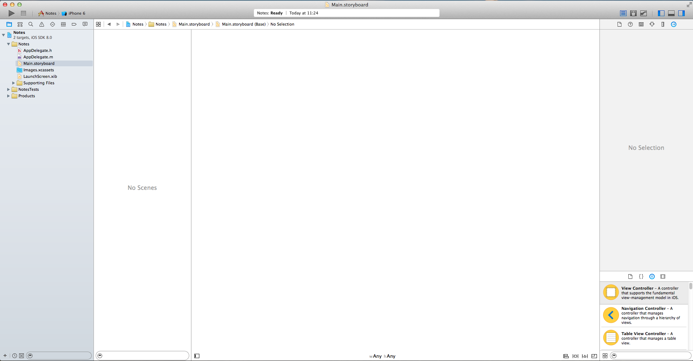

#Setting up a new project

Open Xcode 6 and select *File -> New Project*. Then choose create a *Single View Application*:

Choose the name for your application and select *Objective-C* as language:

After hitting *next* and choosing a project location Xcode will create the new project, based on a project template. You will see that the template contains, among additoinal files, an `AppDelegate` class, a `ViewController` class and a `Main.storyboard` file:

#Configuring the Storyboard

We want to create an App that can display notes. The app will consist of two different View Controllers, the first one will display a list of notes, the second one will display the details of a note when it is selected from the list. We will design the entire layout of this app in Storyboard. Open the `Main.storyboard` file to get started.

##Setting up the Notes List View Controller

Let's start by creating the first View Controller that displays a list of notes. Whenever we want to display items in a list on iOS we use a component called `UITableView`. Since that component is used very often Interface Builder provides a template View Controller called *Table View Contoller* that provides a basic table view and a ViewController that is associated with it. Before we create it let's remove the default View Controller that has been created as part of the template:

- Select the View Controller in the Storyboard by clicking into it and hit the delete key
- Remove the `ViewController` class from Xcode (Selectn "Move to Trash" when prompt appears)

Now your Xcode project should look like this:

Now select the *Table View Controller* from the Object Library on the bottom right of the Interface Builder UI. You can use the search bar at the bottom to filter the list:

Drag the selected Controller to the Storyboard stage. Now you have added the first View Controller to your app.

iOS needs to know which View Controller in our app shall be displayed (that is called the root View Controller). In Storyboard we can configure this setting by selecting the Table View Controller and opening the Attributes Inspector in the right panel. Here we can select the setting *is initial View Controller*:

Make sure you have selected the Table View Controller and not the Table View, otherwise you won't be able to find the setting in the inspector. The easiest way to ensure that the Controller is selected is using the Scene Overview in the left panel.

Now we can run the App for the first time and we should be able to see an empty list:

You will realize that the iPhone 6 and the iPhone 6 Plus Simulators have large screen sizes. If you are working on a Mac with a small screen you might want to downscale the iOS Simulator:

##Adding a Detail View Controller